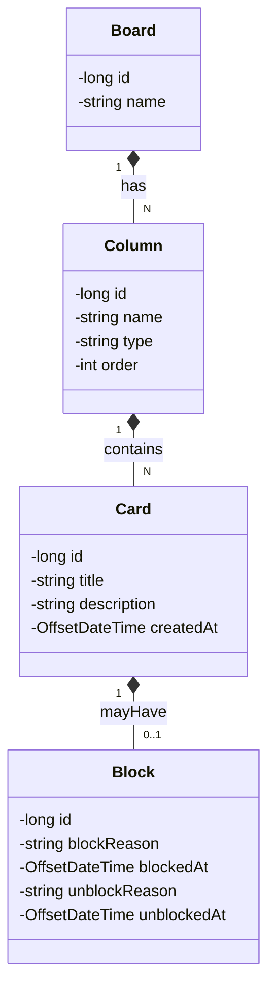

# Projeto-Gerenciamento_de_tarefas

## Diagrama de Classes (Domínio da API)

```mermaid
classDiagram
  class Board {
    -long id
    -string name
  }

  class Column {
    -long id
    -string name
    -string type
    -int order
  }

  class Card {
    -long id
    -string title
    -string description
    -OffsetDateTime createdAt
  }

  class Block {
    -long id
    -string blockReason
    -OffsetDateTime blockedAt
    -string unblockReason
    -OffsetDateTime unblockedAt
  }

  Board "1" *-- "N" Column : has
  Column "1" *-- "N" Card : contains
  Card "1" *-- "0..1" Block : mayHave

```
